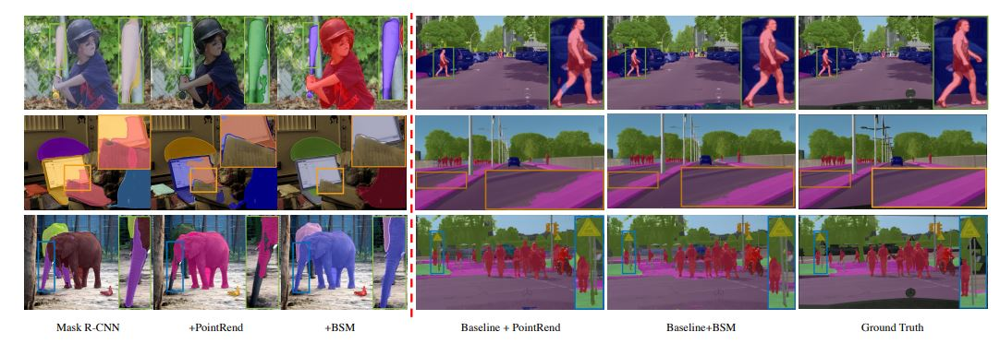

# BoundarySqueeze: Image Segmentation as Boundary Squeezing [[Arxiv]](https://arxiv.org/pdf/2105.11668.pdf)
Hao He, Xiangtai Li,  Guangliang Cheng, Yunhai Tong, Lubin Weng

This paper proposes a novel method for high-quality image segmentation of both objects and scenes. 
Inspired by the dilation and erosion operations in morphological image processing techniques, the pixel-level image segmentation problems are treated as squeezing object boundaries.

### Comparison with Point Rend
 

Our method is built on the codebase of [CVPOD](https://github.com/Megvii-BaseDetection/cvpods).


## Install, Training and Testing

```shell

# Or, to install it from a local clone:
git clone https://github.com/lxtGH/BSSeg
cd BSSeg

pip install -r requirements.txt

python setup.py build develop

# Preprare data path
ln -s /path/to/your/coco/dataset datasets/coco

# Enter a specific experiment dir 
cd playground/


# Train
pods_train --num-gpus 8
# Test
pods_test --num-gpus 8 \
    MODEL.WEIGHTS /path/to/your/save_dir/ckpt.pth # optional
    OUTPUT_DIR /path/to/your/save_dir # optional

# Multi node training
## sudo apt install net-tools ifconfig
pods_train --num-gpus 8 --num-machines N --machine-rank 0/1/.../N-1 --dist-url "tcp://MASTER_IP:port"
```

If you find this codebase is useful to your research, plese consider cite the paper and original codebase.

```BibTeX
@misc{he2021boundarysqueeze,
    title={BoundarySqueeze: Image Segmentation as Boundary Squeezing},
    author={Hao He and Xiangtai Li and Guangliang Cheng and Yunhai Tong and Lubin Weng},
    year={2021},
    eprint={2105.11668},
    archivePrefix={arXiv},
    primaryClass={cs.CV}
}

@misc{zhu2020cvpods,
  title={cvpods: All-in-one Toolbox for Computer Vision Research},
  author={Zhu*, Benjin and Wang*, Feng and Wang, Jianfeng and Yang, Siwei and Chen, Jianhu and Li, Zeming},
  year={2020}
}
```
